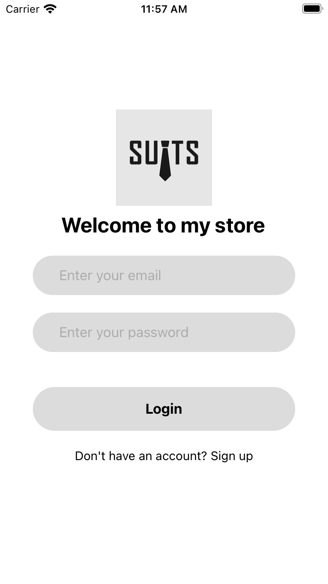
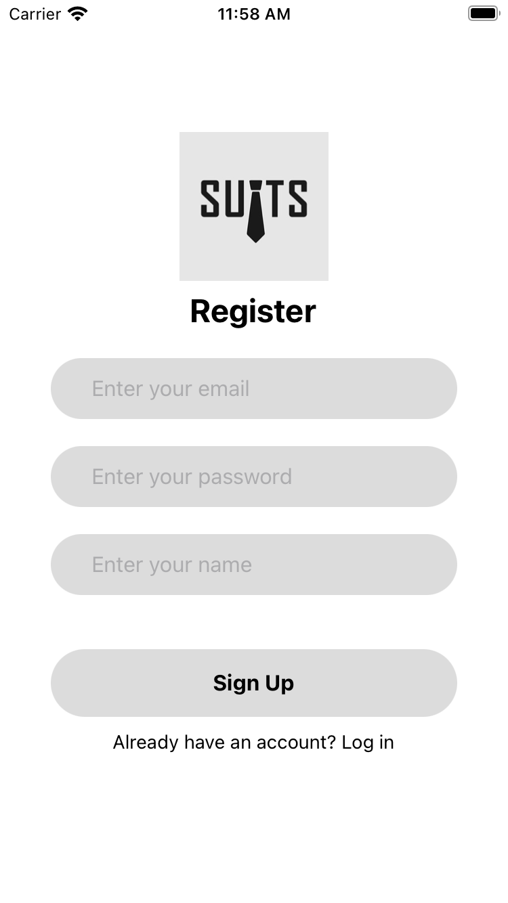
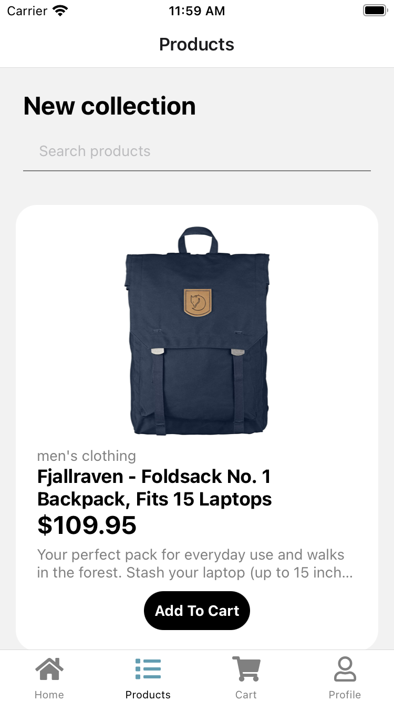
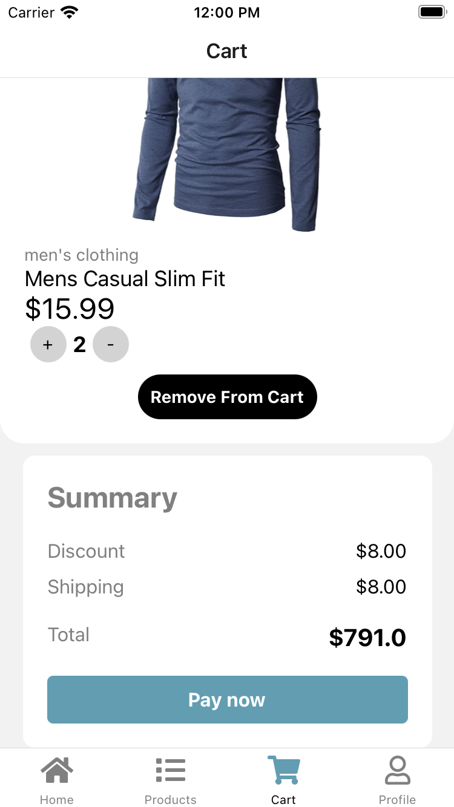
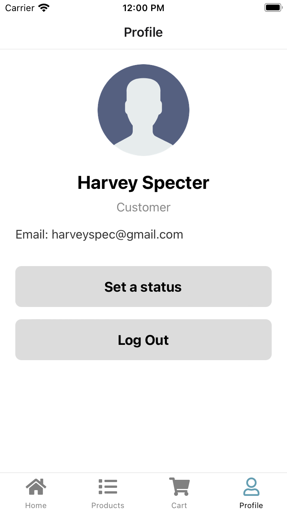

# SUITS STORE MOBILE APPLICATION

## About
Suits Store is designed to provide users with a seamless shopping experience for suits and related products. Whether you're looking for a specific product or just browsing, this app has you covered. With features like user authentication, searching for products, and a user-friendly cart system, shopping for your favourite product has never been easier.

## Features

- User authentication (Login and Signup)
- Product browsing and searching
- Adding products to the shopping cart
- Cart management (add, remove, update quantity)
- Total price calculation for items in the cart
- User profile with basic information

## Used technologies

- React Native
- Redux Toolkit and Redux for state management
- AsyncStorage for local data storage
- React Navigation for navigation
- Axios for making API requests
- Expo for development and building
- TailwindCSS for styling
- FakeStoreAPI for backend

### Prerequisites

Before you can run the app, ensure you have the following software/tools installed:

- Node.js
- npm or Yarn
- Expo CLI

## Some screenshot from the application

